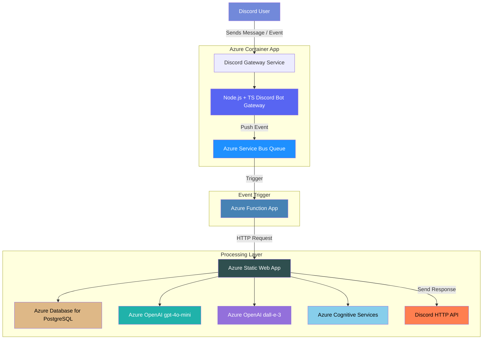

# AURA – Advanced Universal Recreational Activities

**AURA** is an AI-powered Discord bot built to spark conversation, create community, and keep your server active and fun. From daily engagement tools to creative mini-games, AURA is your all-in-one entertainment hub for Discord.

**Try it out ➡️**: [AURA on Discord](https://discord.com/discovery/applications/1354259880122519742)

This project was originally created as an official entry for the [Azure AI Developer Hackathon](https://devpost.com/software/aura-advanced-universal-recreational-activities), where developers build intelligent apps using Azure services and GitHub Copilot. AURA — *Advanced Universal Recreational Activities* — was built entirely on Azure AI, Azure Service Bus, Azure Function Apps, Azure Container Apps, and many other Azure tools to show how production-grade bots can be rapidly prototyped and deployed with Microsoft's ecosystem.

> ⚠️ **Note**: AURA is currently available only while our Azure free trial remains active. Some services may be temporarily offline.

> Also note that there are part of this project that are not fully functional yet. I ran out of time 👀 me been busy 😭

---

## 📦 Table of Contents

- [AURA – Advanced Universal Recreational Activities](#aura--advanced-universal-recreational-activities)
  - [📦 Table of Contents](#-table-of-contents)
  - [🧠 About the API Server](#-about-the-api-server)
  - [💬 What it does](#-what-it-does)
  - [✨ Operational Commands](#-operational-commands)
    - [Chat and Vibe](#chat-and-vibe)
    - [Image Generation](#image-generation)
    - [Translation](#translation)
  - [🏗️ Architecture](#️-architecture)
    - [1. Event Ingestion – Azure Container App (Discord Gateway)](#1-event-ingestion--azure-container-app-discord-gateway)
    - [2. Decoupling with Azure Service Bus](#2-decoupling-with-azure-service-bus)
    - [3. Processing – Azure Function App](#3-processing--azure-function-app)
    - [4. Core Processing – Azure Static Web App (Next.js)](#4-core-processing--azure-static-web-app-nextjs)
    - [🔁 Why This Architecture?](#-why-this-architecture)
  - [🛠 Getting Started](#-getting-started)
    - [1. Clone the repo](#1-clone-the-repo)
    - [2. Set up environment variables](#2-set-up-environment-variables)
    - [3. Install dependencies](#3-install-dependencies)
    - [4. Build the project](#4-build-the-project)
    - [5. Start the server](#5-start-the-server)
  - [☁️ Deployment](#️-deployment)
  - [🧪 Testing](#-testing)
  - [🧱 Challenges we ran into](#-challenges-we-ran-into)
    - [1. Juggling tons of Azure services and making 'em play nice](#1-juggling-tons-of-azure-services-and-making-em-play-nice)
    - [2. Some SDKs were... less than ideal](#2-some-sdks-were-less-than-ideal)
    - [3. Azure Container App deploys failed unless scripted manually](#3-azure-container-app-deploys-failed-unless-scripted-manually)
    - [4. Static Web Apps log visibility? What's that? I still dunno 😭](#4-static-web-apps-log-visibility-whats-that-i-still-dunno-)
    - [5. School = no time 💀](#5-school--no-time-)
  - [🏆 Accomplishments we're proud of](#-accomplishments-were-proud-of)
  - [📚 What we learned](#-what-we-learned)
  - [🚀 What's Next for AURA](#-whats-next-for-aura)
  - [🤖 Copilot Usage](#-copilot-usage)
  - [📄 License](#-license)
  - [🌐 Part of the AURA Ecosystem](#-part-of-the-aura-ecosystem)

## 🧠 About the API Server

This repository hosts the **AURA API Server**, the brain of the system. It processes all incoming events, handles business logic, manages user data, and orchestrates responses between the gateway, Azure Function relays, and external services.

This server enables powerful features such as:

- AI-driven conversation starters and games
- Image generation and translation
- Modular feature deployment for individual communities

---

## 💬 What it does

AURA is an intelligent, multi-modal Discord bot that drives server engagement through AI-powered conversation starters, interactive games, creative challenges, and voice-based activities. It features daily questions, trivia nights, XP systems, leaderboards, drawing prompts, and even real-time voice games — all backed by Azure AI and designed to be modular, scalable, and deeply interactive.

Inspired by community servers at Oregon State University and Jackbox game nights with friends, the goal was to build something that’s not just a novelty or tool — but a full-fledged, *social heartbeat* for your Discord community.

---

## ✨ Operational Commands

### Chat and Vibe

Chat with AURA for fun and engaging conversations. Simply type your message in the chat, and AURA will respond with a friendly reply. Looking for AURA specifically? Just tag it with `@AURA`!

- `@AURA <message>`: Chat with AURA and get a response.

### Image Generation

Generate images using DALL·E 3 based on your prompts. You can specify the number of images you want to generate and provide a detailed description of what you want to see.

- `@AURA generate image <number of images> <prompt>`: Generate images based on a prompt using DALL·E 3.

> Note: Due to Azure Quota Limiations, only 1 image can be generated at a time.

### Translation

Translate text into different languages using Azure Cognitive Services. You can specify the target language or let AURA choose the best one for you.

- `@AURA translate <text>`: Translate text into English.
- `@AURA translate to <language> <text>`: Translate text into a specified language.
- `@AURA translate to <language1,language2> <text>`: Translate text into multiple languages.

---

## 🏗️ Architecture



The architecture of AURA is designed to balance **real-time responsiveness**, **modularity**, and **fault tolerance** using a fully Azure-native stack. Here’s a breakdown of the system:

### 1. Event Ingestion – Azure Container App (Discord Gateway)

When a user interacts with the bot on Discord (e.g., sending a message or using a slash command), these events are received by a **custom-built gateway service** running in an **Azure Container App**. This service is built with **Node.js + TypeScript**, and its sole responsibility is to receive, validate, and forward Discord events.

Instead of processing requests directly, the gateway uses the **Azure Service Bus Queue** to offload incoming events. This approach enables a **“push-and-forget” pattern**, meaning the gateway remains lightweight, efficient, and highly available. It doesn't wait for a downstream response, improving scalability and responsiveness under load.

### 2. Decoupling with Azure Service Bus

Azure Service Bus acts as a **buffer and retry mechanism** between the container app and the processing logic. In the event of failures, messages can be retried automatically without requiring manual intervention. This ensures **resilience and delivery guarantees**, which are important in real-time systems like chatbots.

It also simplifies the architecture: Azure Functions can be easily triggered by Service Bus events, whereas directly triggering a Static Web App from the container would require custom retry and error-handling logic.

### 3. Processing – Azure Function App

The **Azure Function App** is triggered when a new message is posted on the Service Bus. It acts as an HTTP client and delegates the actual processing to the **Next.js app** hosted as an **Azure Static Web App**.

This separation keeps the processing stateless, loosely coupled, and highly scalable. It also allows the processing layer to evolve independently from the gateway.

### 4. Core Processing – Azure Static Web App (Next.js)

The Static Web App is built on **Next.js** and handles all core business logic. It provides a suite of **API routes** that the Azure Function can call, and these routes manage:

- **Database Operations:** Via **Azure Database for PostgreSQL**, storing user profiles, XP, session history, and game state.
- **Text Generation:** Using a **fine-tuned GPT-4o-mini** model on **Azure OpenAI**, the app generates conversation starters, game prompts, and responses tailored to the user context.
- **Image Generation:** For drawing prompts or creative games, it leverages **DALL·E 3**.
- **Translation Services:** Through **Azure Cognitive Services Translator**, enabling multilingual interactions based on user locale.
- **Safety & Moderation:** With **Azure Content Safety** to filter or flag unsafe responses.

Once the processing is complete, the Static Web App sends the final response directly back to **Discord's HTTP API**, ensuring messages are delivered quickly and safely to users.

---

### 🔁 Why This Architecture?

This flow was chosen to emphasize:

- **Reliability**: Service Bus retries and async flow ensure robustness.
- **Efficiency**: Gateway stays lightweight; processing is decoupled and scalable.
- **Maintainability**: Components are modular and can be independently developed or replaced.
- **Scalability**: Can handle high event throughput with minimal latency.

---

## 🛠 Getting Started

### 1. Clone the repo

```bash
git clone https://github.com/anthonykung/aura-api.git
cd aura-api
```

### 2. Set up environment variables

```bash
cp .env.example .env
```

Fill in the required fields like database credentials, API keys, and service bus configs.

> **Note**: You'll need to set up a PostgreSQL database and Prisma Accelerate to run this server.

### 3. Install dependencies

```bash
npm install
# or
yarn install
```

### 4. Build the project

```bash
npm run build
# or
yarn build
```

### 5. Start the server

```bash
npm start
# or
yarn start
```

---

## ☁️ Deployment

This service is built with Next.js and designed to run on **Azure Static Web Apps**. Use your preferred deployment method or CI/CD workflow.

This is also compatible with **Vercel** and **Netlify**, deployment steps may vary.

---

## 🧪 Testing

Coming soon! We’re planning to add automated OpenAPI tests and integration tests for core features and commands.

PostMan collection is also available upon request.

---

## 🧱 Challenges we ran into

### 1. Juggling tons of Azure services and making 'em play nice

**What it is:** Integrating multiple Azure services like Service Bus, Function Apps, Static Web Apps, and OpenAI APIs required careful orchestration. Each service had its own quirks, configurations, and limitations.

**How we dealt with it:** Well, this screenshot sums it up:


We spent a lot of time reading documentation, exploring sample projects, and experimenting with different configurations. Most importantly, we just try something and look at the logs to see what's happening. It might not be the most efficient way, but you get to see what each service is doing and how they interact with each other.

---

### 2. Some SDKs were... less than ideal

**What it is:** Certain Azure SDKs lacked features or had incomplete documentation, making it difficult to implement some functionalities directly. Some were also only available in JavaScript, which makes it hard to use in a TypeScript project.

**How we dealt with it:** We switched to using REST APIs for services where SDKs fell short. This provided more control and flexibility, albeit at the cost of writing additional boilerplate code. It is faster than figuring out how to use the SDKs in the TypeScript project so we just went with it.

---

### 3. Azure Container App deploys failed unless scripted manually

**What it is:** Deploying Azure Container Apps through the portal or CLI often resulted in errors due to missing configurations or resource dependencies.

**How we dealt with it:** We created custom deployment scripts to automate the process. These scripts ensured all required resources were provisioned and configured correctly before deployment. See the [publish.sh](https://github.com/Anthonykung/aura-gateway/blob/main/publish.sh) file for details. Of course, this is a hacky solution and not the best practice, but it worked for us in a pinch.

---

### 4. Static Web Apps log visibility? What's that? I still dunno 😭

**What it is:** Debugging issues in Azure Static Web Apps was challenging due to limited log visibility and lack of real-time monitoring tools. All I can see is the number of requests and some metrics along those lines. I needed a way to see the error messages from the serverless functions but I couldn't find a way to do that.

**How we dealt with it:** Since I can't figure out a way to see the logs or console output from the serverless functions, I had to rely on local testing and debugging. Now the way I deal with this is a little intriguing, first I went to the Azure Function App and monitor the logs there. I added the console logs so it output the Azure Service Bus messages and the HTTP requests to the console. Then I used PostMan to send requests to the local API server using the output and see the responses. This was a bit tedious, but it allowed me to test the core functionalities before deploying them to Azure.

---

### 5. School = no time 💀

**What it is:** Balancing development with academic responsibilities meant limited time to work on the project, leading to incomplete features and rushed implementations. As a student researcher, I also have to work for the school, which further limits my time.

**How we dealt with it:** We prioritized core functionalities that aligns with the Hackathon requirements and adopted an iterative development approach. Features that couldn’t be completed were documented for future implementation, ensuring the project could still function as a proof of concept.

---

## 🏆 Accomplishments we're proud of

- **Azure-Centric Architecture**: Successfully built the entire system using Azure services, even though I typically use platforms like Vercel. This required learning and integrating multiple Azure tools, such as Service Bus, Function Apps, and Static Web Apps, into a cohesive and scalable architecture.
- **Cross-Service Integration**: Mastered the orchestration of diverse Azure services to create a seamless flow of data and events. For example, using Service Bus for decoupling, Function Apps for event-driven processing, and PostgreSQL for persistent storage.
- **AI-Powered Features**: Implemented advanced AI capabilities, such as GPT-4o-mini for text generation, DALL·E 3 for image generation, and Azure Cognitive Services for translation. These features were designed to enhance user engagement and provide a unique, interactive experience.
- **Rapid Prototyping with GitHub Copilot**: Leveraged GitHub Copilot to accelerate development, enabling me to focus on high-level architecture and feature design while automating repetitive coding tasks.
- **Overcoming Challenges**: Despite limited time and resources, managed to deliver a functional proof of concept. This included addressing deployment issues, debugging SDK limitations, and juggling academic responsibilities alongside development.
- **Building Something Fun and Engaging**: Created a bot that goes beyond utility to become a social centerpiece for Discord communities, with features like conversation starters, games, and creative challenges.
- **Documentation and Transparency**: Provided detailed documentation of the architecture, challenges, and future roadmap to ensure the project is easy to understand and extend.

---

## 📚 What we learned

- **Real-world GitHub Copilot use ✨**: Leveraged GitHub Copilot extensively to accelerate development, especially for boilerplate code, API integrations, and debugging. It was instrumental in reducing development time and allowed us to focus on solving architectural challenges and implementing core features.
- **Azure AI integration in async microservices**: Gained hands-on experience integrating Azure AI services like OpenAI GPT-4o-mini, DALL·E 3, and Cognitive Services Translator into a microservices architecture. This involved designing efficient workflows for real-time and asynchronous processing.
- **Azure Services orchestration**: Learned how to orchestrate multiple Azure services, including Service Bus, Function Apps, and Static Web Apps, to create a scalable, fault-tolerant system. This required understanding service dependencies, retry mechanisms, and best practices for inter-service communication.
- **Azure Service Bus is legendary**: Discovered the power of Azure Service Bus for decoupling components and ensuring reliable message delivery. Its retry policies and dead-letter queues were invaluable for handling transient errors and maintaining system stability.
- **Azure Function Apps are awesome**: Explored the flexibility of Azure Function Apps for event-driven processing. They allowed us to handle Service Bus messages efficiently and delegate complex logic to the Static Web App, keeping the system modular and scalable.
- **Debugging in a distributed system**: Faced challenges with debugging across multiple Azure services and learned to rely on logs, local testing, and manual tracing to identify and resolve issues. This experience highlighted the importance of robust monitoring and logging tools in production systems.
- **Balancing academic and project responsibilities**: Managed to deliver a functional proof of concept despite time constraints, demonstrating the importance of prioritization, iterative development, and effective time management.
- **Building for engagement**: Understood the nuances of designing AI-powered features that are not just functional but also engaging and fun for users. This included creating conversation starters, games, and creative challenges tailored to Discord communities.

---

## 🚀 What's Next for AURA

Looking ahead, AURA's roadmap is focused on enhancing stability, deepening interactivity, and improving usability for broader adoption. Key goals include:

- **Improving System Reliability**: Addressing current bugs and refining system performance across services and integrations.
- **Expanding Voice-Driven Multiplayer Games**: Enhancing the voice-based game experience with real-time, multiplayer interaction using Azure Cognitive Services and SignalR.
- **Introducing Visual Storytelling**: Integrating DALL·E and Azure Vision APIs to support narrative-based, visual gameplay.
- **Developing an Admin Dashboard**: Creating a customizable interface for Discord server managers to control features, analytics, and user configurations.
- **Launching a Public Beta**: Piloting AURA with real communities to gather usage feedback and validate engagement outcomes.
- **Implementing Responsible AI Practices**: Integrating moderation tooling and ethical AI use guidelines for content generation and community safety.
- **Building a Real-Time Frontend Interface**: Leveraging existing SignalR, speech-to-text, and text-to-speech functionalities to create an interactive user-facing web interface for enhanced engagement.

---

## 🤖 Copilot Usage

Some parts of this project were written with the help of **GitHub Copilot VS Code Extension**, so you may encounter code that's unconventional or quirky, but hey it works and it cuts down the development time 😉

---

## 📄 License

Licensed under the [Apache License 2.0](https://www.apache.org/licenses/LICENSE-2.0).

---

## 🌐 Part of the AURA Ecosystem

- [AURA Gateway](https://github.com/anthonykung/aura-gateway)
- [AURA Relay Function](https://github.com/anthonykung/aura-functions)
- [AURA API Server (this repo)](https://github.com/anthonykung/aura-api)

---

Created with 💖 by [Anthony Kung](https://anth.dev) to make Discord a lil more magical.
